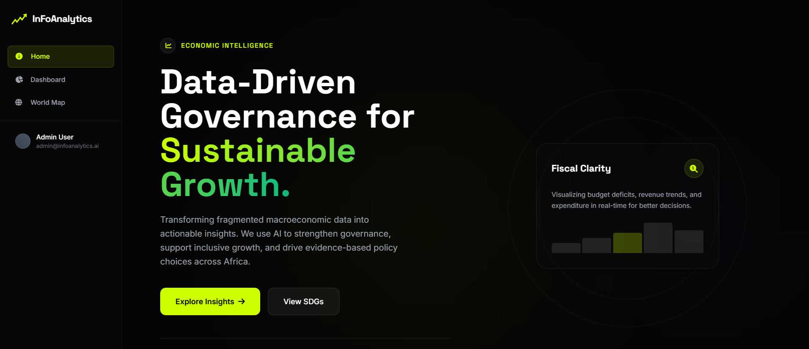
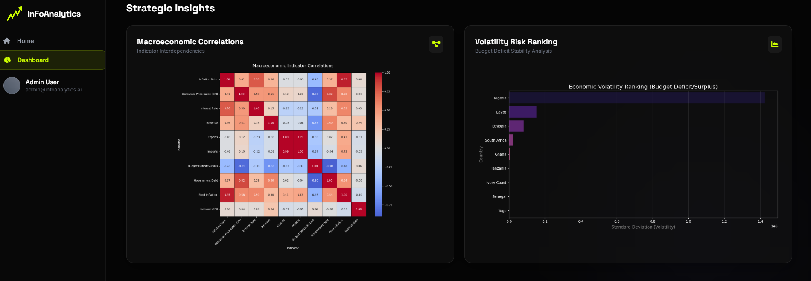
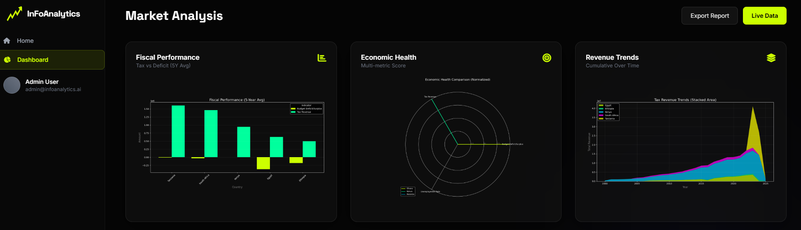
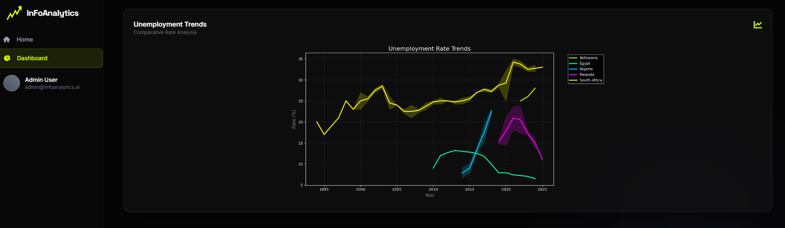

# InFoAnalytics

**AI-Powered Economic Intelligence Dashboard**

InFoAnalytics is a comprehensive platform designed to transform fragmented macroeconomic data into actionable insights. Leveraging Artificial Intelligence and advanced data visualization, it empowers users to monitor fiscal health, analyze economic trends, and make data-driven decisions for sustainable growth, with a specific focus on the African continent.

## 📸 Project Overview

### Main Dashboard

*Real-time economic intelligence and predictive analytics at a glance.*

## 🚀 Key Features

*   **Predictive Modeling:** Machine learning models (Gradient Boosting) to forecast Budget Deficits with high accuracy.
*   **Interactive World Map:** Geospatial analysis of economic indicators (e.g., GDP Growth) across Africa using amCharts.
*   **Deep Dive Analytics:**
    *   **Crisis Watch:** Anomaly detection for inflation and other critical metrics.
    *   **Fiscal Health:** Debt-to-GDP ratio analysis.
*   **Sector Analysis:** Insights into Trade Balance and Government Spending Priorities (Education, Health, Defence).

## 📊 Visualizations

### Strategic Insights

*Analyze dependencies between economic indicators and assess volatility risks.*

### Market Analysis

*Comprehensive view of fiscal performance, revenue trends, and economic health scores.*

### Unemployment Trends

*Comparative analysis of unemployment rates across different regions.*

## 🛠️ Technology Stack

*   **Backend:** Python, Flask
*   **Data Processing:** Pandas, NumPy, Scikit-learn
*   **Frontend:** HTML5, Tailwind CSS, JavaScript
*   **Visualization:** Matplotlib, Seaborn, amCharts 5

## ⚙️ Installation & Setup

1.  **Clone the repository:**
    ```bash
    git clone <repository-url>
    cd InfoAnalytics
    ```

2.  **Install dependencies:**
    ```bash
    pip install -r requirements.txt
    ```

3.  **Run the application:**
    ```bash
    flask run
    ```
    Or for external access:
    ```bash
    flask run --host 0.0.0.0
    ```

4.  **Access the dashboard:**
    Open your browser and navigate to `http://127.0.0.1:5000` (or your local IP).

## 📂 Project Structure

*   `app.py`: Main Flask application entry point.
*   `templates/`: HTML templates for the dashboard and map.
*   `static/`: CSS, JavaScript, and generated chart images.
*   `generate_*.py`: Python scripts for data processing and chart generation.
*   `datasource.csv`: Primary dataset containing economic indicators.

---
*Developed by Leon Motaung*
